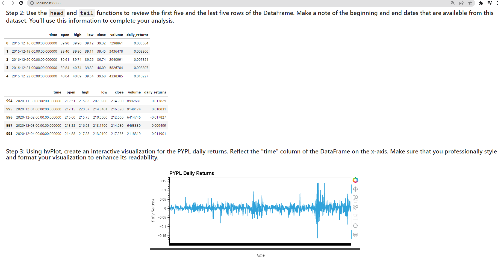
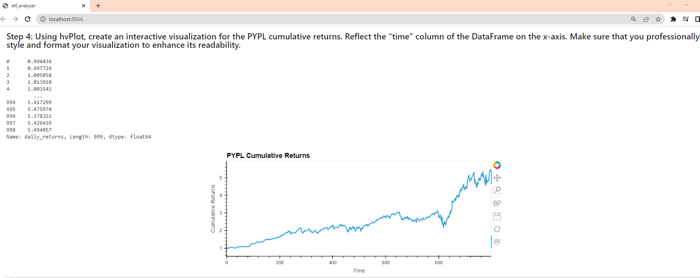
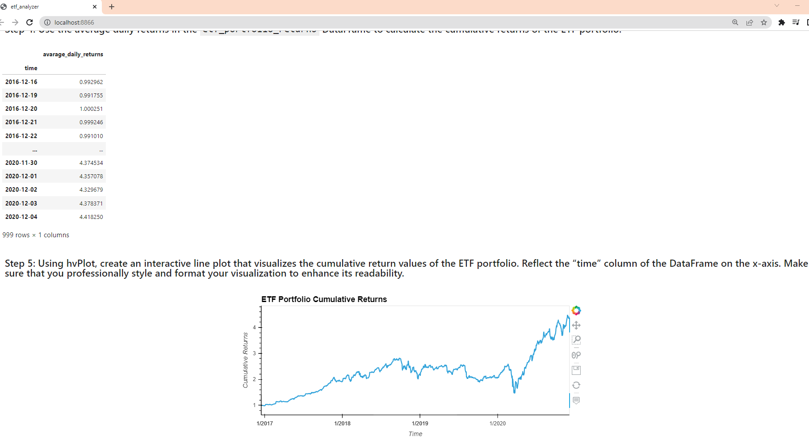

# ETF_Analyzer Documentation
## Description
This project deals with Exchange Traded Funds (ETF) portfolio analysis using Jupyterlab and a [SQLite](https://www.sqlite.org) database that contains various transactions of ETFs over a period of 5 years from 2016 to 2020. Using pandas, we create dataframes to load the ETFs and perform ad-hoc analysis over the data to plot different visualizations. In the end, the Jupyterlab notebook was hosted as a web application locally using [Voila](https://voila.readthedocs.io/en/stable/using.html).

## Data
Database used is SQLLite, and the .db file is provided in this repo at the location `etf.db` in the root folder.

## JupyterLab files
[etf_analyzer.ipynb](etf_analyzer.ipynb)
This file demonstrates how to collect, prepare and analyze the data of ETF transactions between 2016 and 2020 using JupyterLab.

## Screenshots
*This is a screenshot from the web application showing daily returns*

*These screenshots from the web application show cumulative daily returns*

